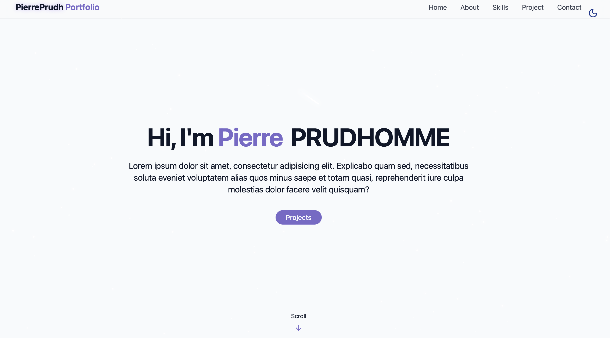
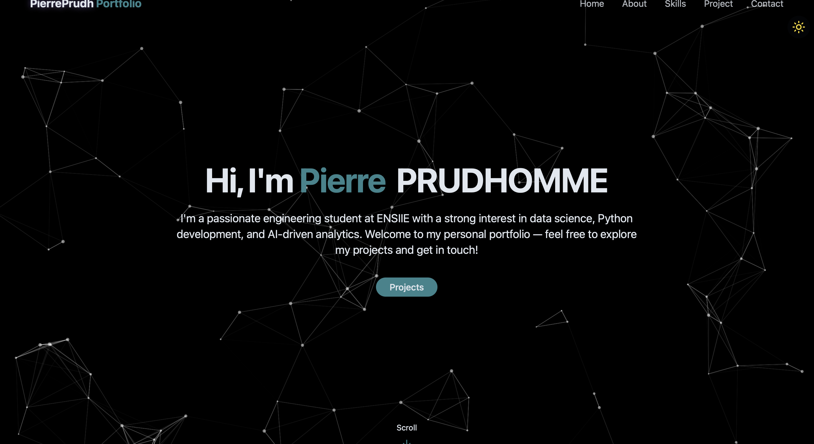

<div align="center">
  <div>
    
    
    
    
    
  </div>
</div>

# 📁 Portfolio — Pierre Prudhomme

Welcome to my personal portfolio, built using React and Tailwind CSS. This project highlights my background, featured projects, and contact information through a sleek, responsive design with full light 🌞 and dark 🌙 mode support, including an animated Aurora background and starfield effects.

---

## 🌐 Live Demo

Experience the portfolio live, hosted on **Vercel**:  
🔗 [portfolio-pierreprudh.vercel.app](https://portfolio-pierreprudh.vercel.app)

---

## 🚀 Preview

| Light Mode | Dark Mode |
|------------|-----------|
|  |  |

Watch the [base tutorial](https://www.youtube.com/watch?v=ifOJ0R5UQOc&t=4615s) on YouTube.


---

## ✨ Features

- ⚡ Fully responsive layout for all screen sizes
- 🎨 Smooth theme transitions (light/dark mode)
- 🧩 Modular and reusable components
- 📂 Dynamic project section sourced from a JSON config
- ✉️ Contact section with icon-enhanced links
- 🌌 Dynamic animated Aurora background in light mode, and starfield background in dark mode

---

## 🛠️ Tech Stack

- ⚛️ **React**
- 💨 **Tailwind CSS**
- 🌙 **Dark Mode** via Tailwind
- 📦 **Vite** for bundling and dev server
- 🌈 Custom CSS animations with Tailwind and keyframes

---

## 📁 Folder Structure

```
src/
├── assets/            # Static images and icons
├── components/        # UI components (Navbar, Footer, Cards, Backgrounds)
├── data/              # Project or contact data in JSON
├── pages/             # Section containers (Home, Projects, Contact)
├── App.jsx            # Main layout and routing
└── main.jsx           # App entry and root render
```

---

## ▶️ Development

Install dependencies:

```bash
npm install
```

Start the development server:

```bash
npm run dev
```

---

## 🏗️ Production Build

Build the app for production:

```bash
npm run build
```

Preview the production build locally:

```bash
npm run preview
```

---
