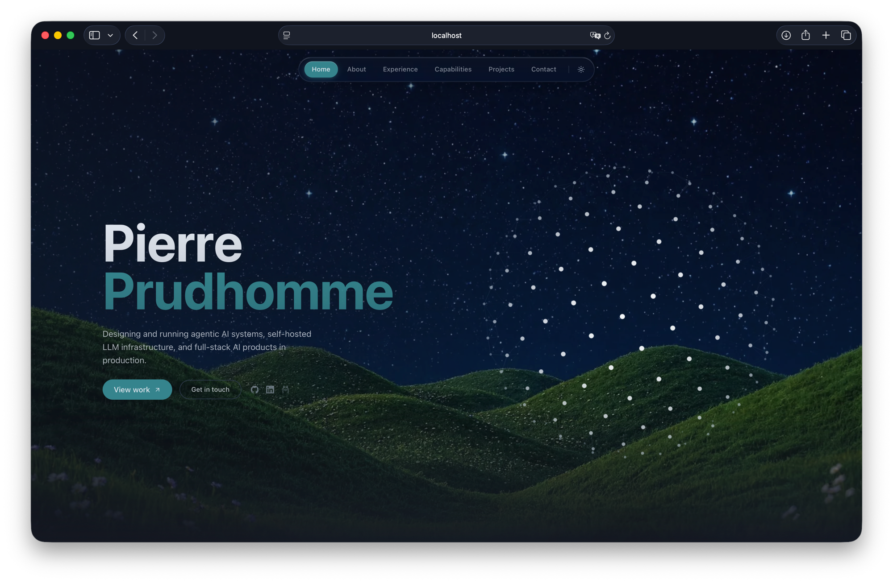
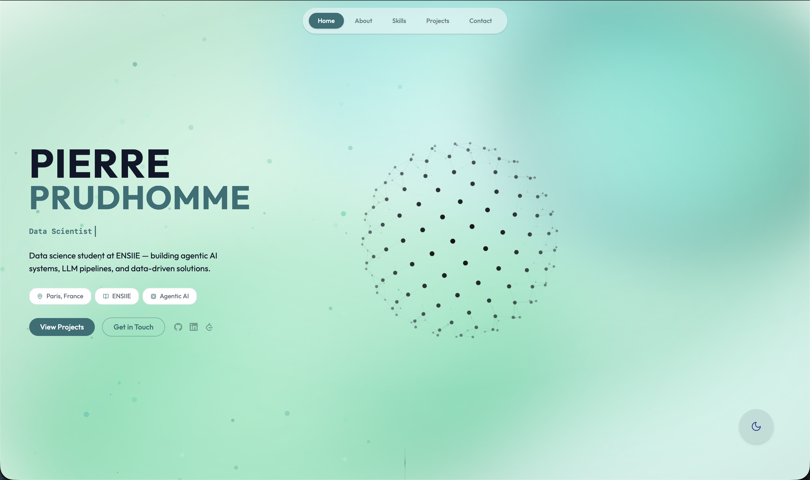
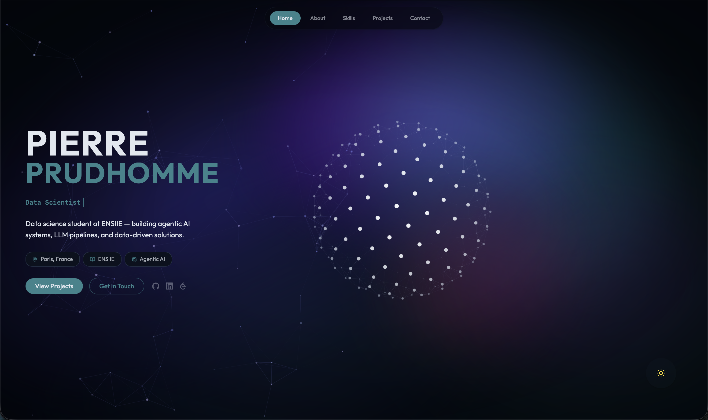
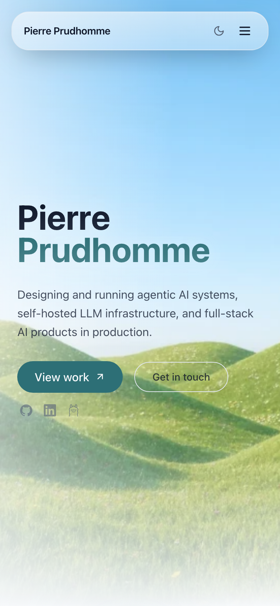
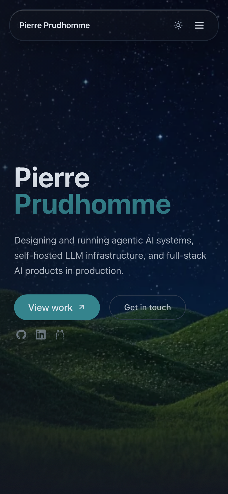

<div align="center">
  <div>
    
    
    
    
    
    
  </div>
</div>

# Portfolio — Pierre Prudhomme

Personal portfolio built with React and Tailwind CSS. Highlights my background as a Data Scientist and AI Engineer, featuring projects, skills, and contact info — with a polished, fully responsive design and light/dark mode support.

---

## 🌐 Live Demo

Hosted on **Vercel**:
🔗 [portfolio-pierreprudh.vercel.app](https://portfolio-pierreprudh.vercel.app)

---

## 🚀 Preview



| Light Mode | Dark Mode |
|------------|-----------|
|  |  |
|  |  |

---

## ✨ Features

- Cinematic hero: scenic day/night backdrop with camera-settle entrance, scroll + pointer parallax, and a constellation sphere with cursor repulsion
- Light/dark theme toggle that swaps the entire scenery
- Apple-style motion system: blur-up reveals, scroll-linked hero dismissal, spring interactions (Motion + Lenis smooth scrolling)
- Linear-style capability cards that flip to grouped, scrollable stack lists
- Floating glass pill navbar with scroll-aware active section tracking and mobile accordion menu
- Projects bento with in-view video demo and archive index
- Ambient drifting color glows behind the whole page (static on mobile for GPU thrift)
- Responsive WebP hero images with theme-aware preload, JSON-LD, sitemap and robots.txt
- Fully responsive, with `prefers-reduced-motion` support throughout

---

## 🛠️ Tech Stack

- **React 19** with hooks
- **Tailwind CSS v4**
- **Vite 7** for bundling and dev server
- **Motion** (Framer Motion) for scroll-linked and spring animations
- **Lenis** for smooth scrolling
- **react-router-dom** for routing
- **lucide-react** and **react-icons** for icons
- **clsx** + **tailwind-merge** for conditional class utilities
- Custom CSS keyframe animations

---

## 📁 Folder Structure

```
src/
├── assets/            # Static images
├── components/        # All UI components (sections, navbar, backgrounds, effects)
├── lib/               # Utility functions (cn helper)
├── pages/             # Page-level containers (Home, NotFound)
├── App.jsx            # Root layout and routing
└── main.jsx           # App entry point
```

---

## ▶️ Development

Install dependencies:

```bash
npm install
```

Start the development server:

```bash
npm run dev
```

---

## 🏗️ Production Build

```bash
npm run build
npm run preview
```
